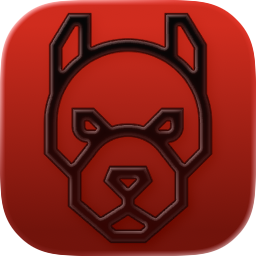
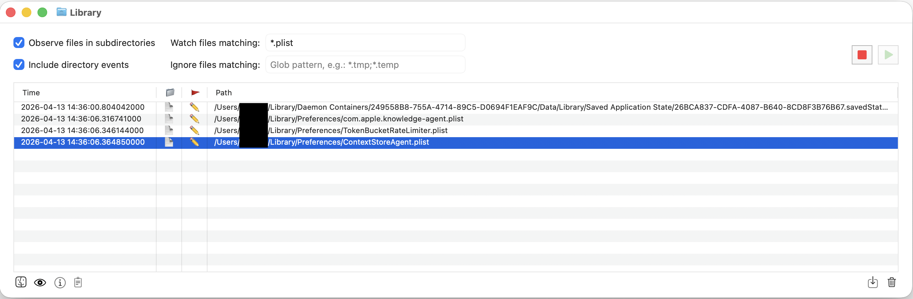

# Watchdog.app


Watchdog is an app for monitoring file changes in directories.<br>
It is built with OMC engine:<br>
https://github.com/abra-code/OMC/<br>

It utilizes "watchdog" python module:<br>
https://pypi.org/project/watchdog/<br>
<br>



### How it is put together

The window is an ActionUI JSON document, `Watchdog.app/Contents/Resources/Base.lproj/Watchdog.json`,
and every command handler is a Python script under `Watchdog.app/Contents/Resources/Scripts/`.
The commands themselves are declared in `Watchdog.app/Contents/Resources/Command.json`.
Requires OMC 5.3 or newer.

The eye button opens a second ActionUI document, `Base.lproj/Preview.json`, holding
one `QuickLook` element. That element comes from the `ActionUIQuickLook` add-on,
which `Abracode.framework` links and registers at launch, so the preview is a
window of this app rather than a `qlmanage` process. A chain request carries no
payload, so the selected path travels from the event window to the preview
window's init handler on a named pasteboard, keyed by the event window's uuid -
which the engine hands the new window's subcommands as `$OMC_PARENT_DIALOG_GUID`.

The applet ships no nib of its own. `Info.plist` names no `NSMainNibFile`, so the
engine installs the standard macOS menu bar programmatically. There is no
`MainMenu.json` either: Watchdog adds nothing to that bar and needs no overrides.
(`Abracode.framework` still carries nibs for the engine's own input dialogs.)

`watchdog.export.events` reads the event table over the OMC 5.3 ActionUI remote
bridge (`import omc`), which is the only way a handler can ask the window what it
currently holds. Every other handler reads the values the engine exports when it
dispatches the command.

### Tests

```
appletbuilder test Watchdog.app
```

`Tests/` sits next to the bundle and runs the real handlers against a simulated
OMC environment. See `omctest_guide.md` in the OMC documentation.

### History

Watchdog began as a shell-driven applet with an Interface Builder nib window and a
nib menu bar, and was used as a worked example of moving such an applet to
Python. The original
step-by-step walkthrough and the parallel shell scripts are kept, unmaintained,
under [Archive/](Archive/).
